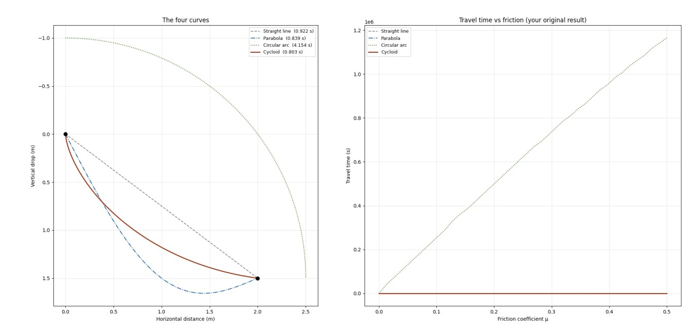

# Brachistochrone Problem Simulation

This simulation solves the brachistochrone problem, where we look for the curve of fastest descent in a gravitational field between two points.

This problem is a classic example from the calculus of variations, demonstrating how the fastest path is not a straight line but a cycloid.

## Capabilities

- Calculation of the optimal trajectory (cycloid)
- Comparison with straight-line motion in terms of time
- Visualization of the trajectory

## Usage

Run the simulation:
 

RESULT

The cycloid curve reaches the endpoint faster than the straight line, confirming the brachistochrone principle.
